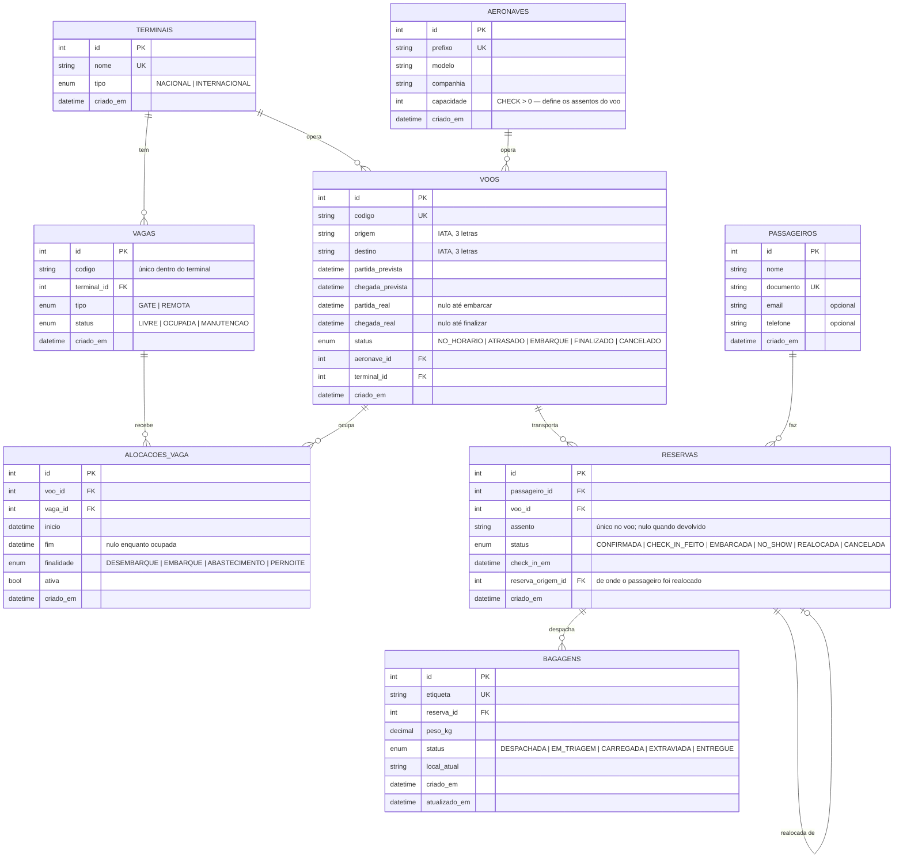
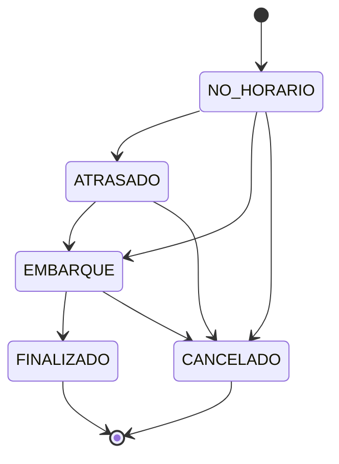
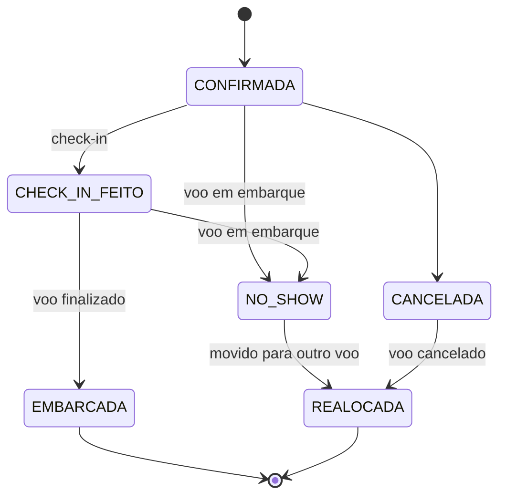
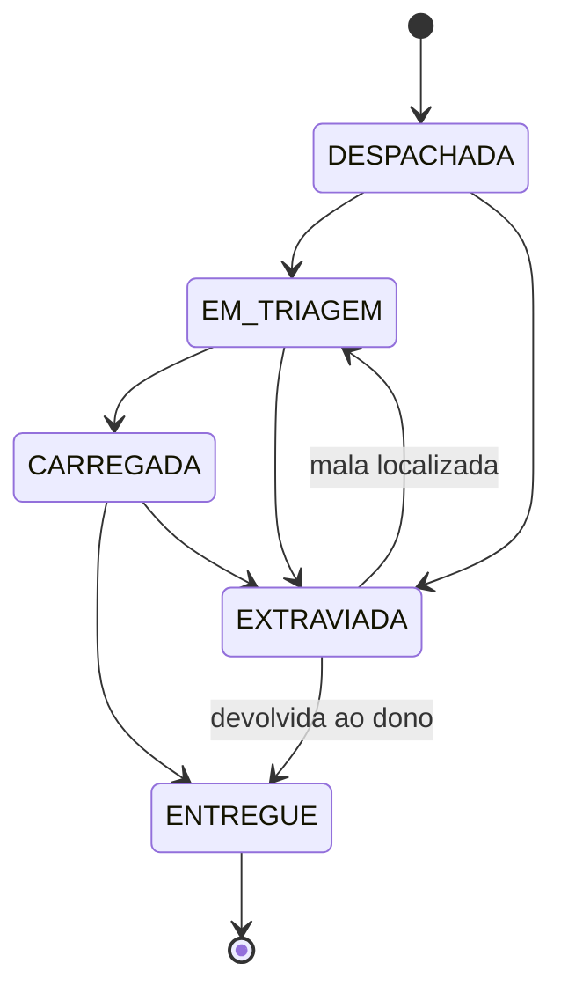

# Modelagem do banco

O enunciado trata a modelagem como a base de todo o sistema, então esta é a peça que veio primeiro:
as telas foram desenhadas depois das tabelas, e não o contrário.

São **8 tabelas** em MySQL, criadas do zero e normalizadas. Nenhuma informação derivável fica
guardada — o quanto um voo está cheio, por exemplo, é sempre contado a partir das reservas.

## Diagrama ER



## Decisões de modelagem

### `reservas` é a tabela intermediária entre passageiro e voo

O enunciado descreve duas relações que parecem brigar entre si: *um voo tem vários passageiros* e
*um passageiro pode estar em vários voos ao longo do tempo*. Juntas, são um muitos-para-muitos, e a
dica do PDF é explícita: resolver com tabela intermediária.

`reservas` é essa tabela — mas ela não é só um par de chaves. É onde vive **o estado do passageiro
naquele voo**: confirmado, com check-in feito, embarcado, no-show, realocado ou cancelado. Sem ela,
esse estado não teria onde morar: não é do passageiro (que pode estar tranquilo em outro voo) nem do
voo (que tem 300 passageiros em situações diferentes).

Duas restrições a protegem:

| Restrição | O que impede |
|---|---|
| `UNIQUE (passageiro_id, voo_id)` | A mesma pessoa aparecer duas vezes no mesmo voo |
| `UNIQUE (voo_id, assento)` | Dois passageiros no mesmo assento |

A primeira tem um efeito prático: quando alguém cancela e reserva de novo no mesmo voo, a linha
existente é **reaproveitada** em vez de duplicada.

### `bagagens` aponta para a reserva, não para o passageiro

O enunciado diz que um passageiro pode despachar várias malas, mas **uma mala não pode ter mais de
um dono**. O caminho óbvio seria `bagagens.passageiro_id`. Ele resolve o dono e deixa um buraco: em
*qual voo* essa mala está? Seria preciso uma segunda FK para `voos`, e nada garantiria que as duas
apontassem para a mesma viagem.

Apontar para `reservas` fecha as duas pontas com **uma única chave**: a reserva já sabe quem é o
passageiro e qual é o voo. Um dono, um voo, sem chance de divergirem.

Isso também é o que faz a realocação funcionar de graça: quando o passageiro muda de voo, basta
mover `bagagens.reserva_id` para a reserva nova e as malas viajam junto.

### `reservas.reserva_origem_id` guarda o rastro da realocação

Uma auto-referência: a reserva nova aponta para a que ficou para trás. A reserva antiga vira
`REALOCADA` em vez de sumir, então o histórico de que aquele passageiro perdeu o voo continua
legível na tela do passageiro — a interface mostra "veio da #123".

### `alocacoes_vaga` guarda histórico em vez de sobrescrever

Uma vaga podia ter simplesmente uma coluna `voo_id`. Mas o enunciado descreve uma vaga sendo usada
para desembarque, depois para abastecimento, depois para pernoite — a mesma posição, ao longo do
dia, servindo a propósitos diferentes.

Guardar isso numa coluna significaria perder a ocupação anterior a cada troca. A tabela
intermediária mantém cada passagem com `inicio`, `fim` e `finalidade`, e o campo `ativa` marca qual
delas é a de agora. É isso que a aba "Histórico de vagas" da tela do voo mostra.

Com o período registrado, a API consegue recusar duas aeronaves na mesma posição em horários que se
sobrepõem — algo que uma coluna simples não conseguiria verificar.

### A ocupação nunca é uma coluna

Não existe `voos.assentos_ocupados`. O número sai sempre de:

```sql
SELECT COUNT(*) FROM reservas
WHERE voo_id = ? AND status IN ('CONFIRMADA', 'CHECK_IN_FEITO', 'EMBARCADA');
```

Um contador guardado precisaria ser atualizado em sete lugares diferentes (criar reserva, cancelar,
no-show, realocar, cancelar o voo, finalizar…) e bastaria esquecer um para o sistema passar a mentir.
Derivar custa uma contagem e não tem como ficar errado.

A capacidade vem de `aeronaves.capacidade`, então **trocar a aeronave de um voo muda os assentos
dele** — e a API recusa a troca por um modelo menor que o número de passageiros já confirmados.

### O código da vaga é único por terminal, não no aeroporto

`UNIQUE (terminal_id, codigo)`, e não `UNIQUE (codigo)`. O terminal nacional e o internacional
podem ter, cada um, o seu portão "A1" — que é como aeroportos de verdade numeram os gates.

### Normalização

Nada de "tudo em uma tabela só":

- o modelo e a capacidade da aeronave ficam em `aeronaves`, não repetidos em cada voo;
- o nome e o documento do passageiro ficam em `passageiros`, não copiados em cada reserva;
- o terminal de uma vaga é uma FK, não uma string solta.

Os enums viram tipos `ENUM` no MySQL, o que impede um status escrito errado de entrar na tabela.

## Máquinas de estado

As transições vivem em [`src/utils/enums.py`](../src/utils/enums.py) e são a mesma fonte usada pela
API e pelos botões da interface — a tela só oferece o que o backend aceita, porque o próprio voo
devolve suas `transicoes_permitidas`.

### Voo



Duas transições têm efeito em cascata:

- **FINALIZADO** — quem estava com `CHECK_IN_FEITO` passa a `EMBARCADA`, a `chegada_real` é
  carimbada e a vaga volta a ficar `LIVRE`.
- **CANCELADO** — todas as reservas ativas caem para `CANCELADA` e a vaga é devolvida.

### Reserva



`NO_SHOW` e `CANCELADA` devolvem o assento ao inventário do voo (`assento = NULL`), e é por isso que
a ocupação cai sozinha.

A **realocação** exige que o passageiro tenha perdido o voo (`NO_SHOW`) ou que o voo tenha sido
cancelado, e o voo de destino precisa ter o mesmo destino, partida futura e assento livre.

### Bagagem



`EXTRAVIADA` é alcançável de qualquer estado não-final e tem volta — uma mala achada entra de novo
na triagem ou vai direto para o dono. `ENTREGUE` é o único estado final.

## Onde cada regra está no código

| Regra | Arquivo |
|---|---|
| Transições e conjuntos de status | [`src/utils/enums.py`](../src/utils/enums.py) |
| Estados do voo, cascatas e vagas | [`src/use_cases/voo_use_case.py`](../src/use_cases/voo_use_case.py) |
| Reserva, check-in, no-show, realocação | [`src/use_cases/reserva_use_case.py`](../src/use_cases/reserva_use_case.py) |
| Fluxo da bagagem | [`src/use_cases/bagagem_use_case.py`](../src/use_cases/bagagem_use_case.py) |
| Geração de assentos a partir da capacidade | [`src/utils/assentos.py`](../src/utils/assentos.py) |

Cada uma dessas regras tem teste em [`tests/`](../tests).
